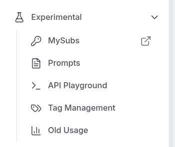
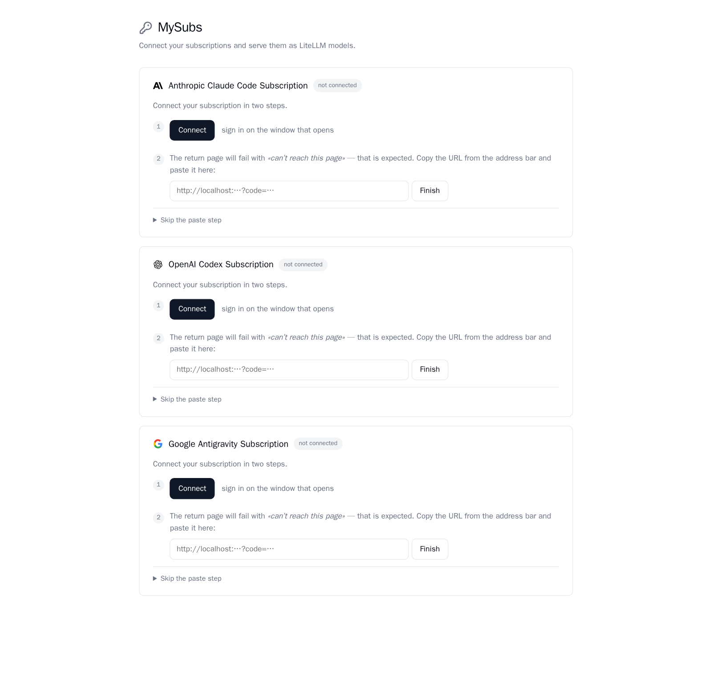
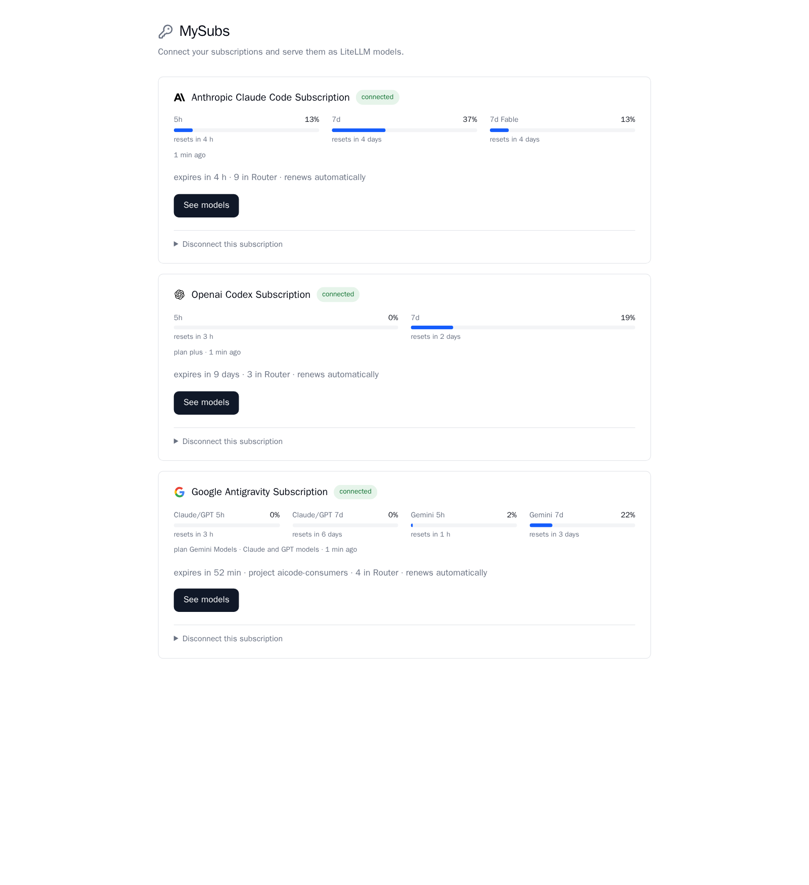
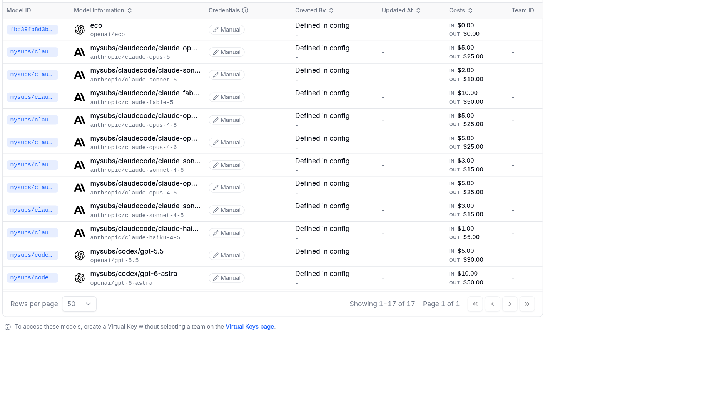

# litellm-mysubs

Serve your Claude Max, ChatGPT Plus (Codex) and Google Antigravity subscriptions as ordinary
OpenAI-compatible models through [LiteLLM](https://github.com/BerriAI/litellm).

The wire protocols are a Python port of [`@oh-my-pi/pi-ai`](https://github.com/can1357/oh-my-pi) —
see [where the wiring comes from](#where-the-wiring-comes-from). What is built here is the
LiteLLM side: the plugin, the UI, and the credential handling.

[](https://pypi.org/project/litellm-mysubs/)
[](https://pypi.org/project/litellm-mysubs/)
[](https://github.com/eduardopessin/litellm-mysubs/actions/workflows/ci.yml)
[](LICENSE)

> **Read this before installing.** This is a personal tool, for your own subscription, on
> your own machine. It signs in with the provider's OAuth flow and keeps the resulting
> token so the proxy can use it — which is not how these providers expect subscription
> credentials to be used. Anthropic's, OpenAI's and Google's terms on subscription
> authentication are theirs to write and to change: read them and decide for yourself.
> Enforcement, if it comes, lands on your account.
>
> Not affiliated with, endorsed by, or connected to Anthropic, OpenAI or Google. Nothing
> here is legal advice, and the MIT licence means exactly what it says about warranty.
>
> If you are looking for something to put in front of other people, use API keys. That is
> what they are for, and every provider supports them in LiteLLM already.

## The problem

A subscription is not an API key, and the difference is not cosmetic:

- **The tokens are first-party OAuth.** They come from the provider's own client flow, they
  rotate, and they expire — there is no static string to paste into `model_list`.
- **The model set is different.** What a subscription serves is not the public API catalog.
  `claude-sonnet-4-20250514` exists on the Anthropic API and returns 404 on a Max account.
  Neither Anthropic nor Codex expose a catalog endpoint for subscription tokens.
- **Each provider speaks its own protocol.** Codex speaks the Responses API, Antigravity
  speaks Cloud Code, Anthropic speaks Messages. None of them is the chat-completions shape
  your client sends.

This package absorbs those three differences so any OpenAI client sees plain LiteLLM models.

## Quickstart

```bash
pip install litellm-mysubs && mysubs-setup
```

1. `mysubs-setup` locates the LiteLLM in your environment and the `config.yaml` it loads,
   then appends one line to it.
2. Restart the proxy.
3. Open the LiteLLM UI as an admin and go to **Experimental → MySubs** (or go straight to
   `<proxy-url>/mysubs`).



4. Press **Connect** on a provider card, sign in, and paste back the URL your browser
   lands on.



5. Pick the models you want and apply. Connected cards show the quota the provider reports:



The single line `mysubs-setup` adds:

```yaml
litellm_settings:
  callbacks: ["litellm_mysubs.proxy_handler_instance"]
```

It does not touch `model_list`, `router_settings` or `general_settings` — routing you
already configured is not the installer's business. It leaves the original at
`config.yaml.mysubs-bak` and refuses to write a file that would no longer load.

### What you end up with

The models you applied appear in **Models + Endpoints** like any other deployment — same
table, same virtual keys, same cost tracking. The subscription is no longer a separate
thing your clients have to know about.



Every one is callable straight away:

```bash
curl $PROXY/v1/chat/completions -H "Authorization: Bearer $KEY" \
  -d '{"model":"mysubs/claudecode/claude-opus-5","messages":[{"role":"user","content":"hi"}]}'
```

## How connecting works

1. **Press Connect.** The card opens the provider's login page in your browser.
2. **Authenticate** with the provider as usual.
3. **Return the result.** Paste the URL your browser ends up on — see below.
4. **Discovery runs.** The page probes each candidate model against your account and shows
   what actually answered. Nothing is listed as available unless the upstream replied.
5. **Pick and apply.** The selected models are injected into the LiteLLM Router under the
   `mysubs/<subscription>/` prefix and are immediately callable by any client.

Tokens are then refreshed in the background, with a `flock` held across processes so that
multiple proxy workers never race on the same rotating refresh token.

### Returning the result

These OAuth clients register `http://localhost:54545/callback` (and `:1455`, `:51121`) as
their redirect. `localhost` resolves in the **browser**, so that port would have to be open
on the machine you are browsing from — and the proxy usually runs somewhere else. The
redirect therefore lands on a page that cannot load. That is expected, and the page tells
you so before you start.

**Paste the URL.** Copy whatever is in the address bar after you authenticate — the
`This site can't be reached` one — and paste it into the box on the page. The authorization
code is in it. This is the default path, it needs nothing installed anywhere, and it works
over SSH, from a phone, or on a machine with no browser at all.

<details>
<summary><b>Optional: skip the paste with a local command</b></summary>

If you would rather not copy anything, the page also issues a pairing code for a helper you
run on the machine with the browser:

```bash
pip install litellm-mysubs
mysubs-login anthropic --url https://your-proxy --code XXXX-XXXX-XXXX
```

It opens the loopback port the provider expects, catches the redirect itself, and deposits
the credential in the proxy. The page notices and moves on by itself.

The pairing code lives ten minutes, is single-use, and authorises exactly one provider —
that is what keeps the proxy admin key off your command line.

If LiteLLM runs on your own machine, drop `--url` and `--code`: it writes straight to the
local store.

</details>

## What is guaranteed

- **Inert until a subscription is connected.** The patch is only applied once at least one
  credential exists. Installed with no subscriptions, it is indistinguishable from not being
  installed — the Router is untouched.
- **Your `config.yaml` survives.** One line appended, a backup written next to it, and a
  refusal to save a file that would not parse.
- **The UI does not depend on a patched bundle.** `/mysubs` is a mounted FastAPI sub-app and
  always works by direct URL. The **Experimental** menu entry is a best-effort string patch
  of a pre-compiled Next.js chunk whose filename is a build hash; when a new LiteLLM version
  does not match, it logs the direct URL instead of failing. Nothing in `site-packages` is
  ever rewritten — the modified copy is served from memory.
- **Credentials go where your policy says.** A `0600` file at
  `~/.litellm/mysubs/credentials.json` by default, the secret manager LiteLLM already has
  configured (`general_settings.key_management_system`) if you run one, or read-only
  environment variables. Loose permissions on the file are rejected, not silently fixed.
- **Never a fabricated number.** An unreachable provider shows the error or the last real
  snapshot labelled with its age. A model name the subscription does not serve returns the
  upstream error — it is never silently answered by a different model.

### Turning it off

| | |
|---|---|
| `MYSUBS_DISABLE=1` | disables everything without editing `config.yaml` |
| `MYSUBS_DISABLE_AUTH=1` | skips the `proxy_admin` check (proxies with no key database) |
| remove the `callbacks` line | uninstalls |

## Providers

| Provider | Model prefix | Wire protocol | Quota reported |
|---|---|---|---|
| Claude Max | `mysubs/claudecode/` | Messages | 5h / 7d, from headers + `/api/oauth/usage` |
| ChatGPT Plus (Codex) | `mysubs/codex/` | Responses API | 5h / 7d, from headers + `wham/usage` |
| Google Antigravity | `mysubs/antigravity/` | Cloud Code | `:retrieveUserQuotaSummary` only |

On the wire that means `api.anthropic.com/v1/messages`,
`chatgpt.com/backend-api/codex/responses`, and `v1internal:streamGenerateContent`.
Antigravity is the one case where the quota endpoint is the only source: measured against
the real backend, it returns no rate-limit headers at all.

Anthropic and Codex have no catalog endpoint for subscription tokens, so their model lists
come from a curated set of measured names plus a live probe of each one. Antigravity has a
real catalog (`:fetchAvailableModels`) and it is used directly.

## Development

```bash
pip install -e ".[dev]"
pytest                  # unit tests
ruff check . && mypy    # lint and types
```

1629 tests, 86% branch coverage (the suite fails below 85%), `ruff` and `mypy --strict`
clean. Tests that touch real LiteLLM internals need the proxy extras:

```bash
pip install "litellm[proxy]"
pytest tests/test_litellm_contract.py
```

That file asserts the internal symbols the patch depends on — `Router.acompletion`,
`route_llm_request.route_request`, `custom_provider_map`. CI runs it against both the pinned
`litellm[proxy]` 1.101.0 and the current release, which turns an incompatible upstream
upgrade into a red build instead of a production outage.

## Where the wiring comes from

The protocol layer is a Python port of [`@oh-my-pi/pi-ai`](https://www.npmjs.com/package/@oh-my-pi/pi-ai)
and its sibling packages ([`can1357/oh-my-pi`](https://github.com/can1357/oh-my-pi)): the
headers each provider expects, the client versions they check, the endpoint paths, the
schema normalisation, the shape of every stream event. That is published work, and this
package does not pretend to have discovered any of it. **If you want the wire logic
itself, go there — it is the source of truth, and when a provider changes, the fix appears
there first.**

Concretely, 13 of the 45 modules carry `# omp:` anchors and are ported — everything under
`wire/`, plus `credentials/oauth.py`, `catalog/discovery.py`, `catalog/usage.py`,
`catalog/usage_probe.py` and `transport/hosts.py`. That is roughly half the source by line
count. The other half is what makes it a LiteLLM plugin rather than a library: the
streaming patch and dispatch (`plugin.py`), the mounted UI and its OAuth pairing (`ui/`),
credential storage and cross-process refresh (`credentials/`, minus `oauth.py`), Router
injection and persistence, and the installer.

What the port adds is traceability. Every borrowed constant carries an anchor naming its
source:

```python
# omp: usage/openai-codex.ts :: CODEX_USAGE_PATH
# omp= CODEX_USAGE_PATH = "wham/usage"
```

CI checks all 186 of them against the published tarballs on every push. The first form
proves the symbol still exists; the second proves its **value** has not changed, which is
the failure that matters — a renamed endpoint or a bumped client version keeps the symbol
and breaks the wire, and that is exactly how `wham/usage` once shipped as
`codex/wham/usage` and returned 403 against every account.

CI also runs the unit suite on Python 3.11, 3.12 and 3.13. When upstream moves, the build
goes red with the file, the symbol and the new value in the message — months before a user
would have found it.

## Architecture

```
src/litellm_mysubs/
├── credentials/   pluggable store (0600 file, secret manager, env), OAuth,
│                  loopback callback server, cross-process refresh lock
├── wire/          one module per provider; they never reference each other
├── transport/     HTTP client, SSE, host failover, retry
├── catalog/       discovery of the models a subscription actually serves, quota
├── ui/            the `/mysubs` sub-app: cards, pairing, apply
├── login_cli.py   `mysubs-login` — the interceptor, run on your own machine
├── setup_cli.py   `mysubs-setup` — the one-line config edit
├── registry.py    Router injection and guards against phantom deployments
└── plugin.py      the only module that mutates global state
```

Every module imports without side effects. Only `plugin.py` modifies LiteLLM, and only when
invoked — which is what keeps the rest unit-testable.

## Design decisions

[`docs/DECISIONS.md`](docs/DECISIONS.md) holds ten entries. Each records what was decided,
**the measurement that supports it**, and what would reopen the question. Without the
measurement it is not a decision, it is a preference.

For example, D1 explains why streaming stays in a monkey-patch instead of the official
`CustomLLM` path: a minimal handler reporting `prompt_tokens=100, completion_tokens=5,
cached_tokens=80` had 8/2 delivered to the client and `cached_tokens` lost, in every one of
the four supported ways of emitting the final chunk. Without real usage, LiteLLM estimates
with `token_counter` and every cache hit becomes invisible in `/spend/logs` — on a
subscription account that is the difference between 8697 and 2876 prompt tokens for the same
request, and the only way to know why the quota ran out.

## License

MIT — see [LICENSE](LICENSE).
